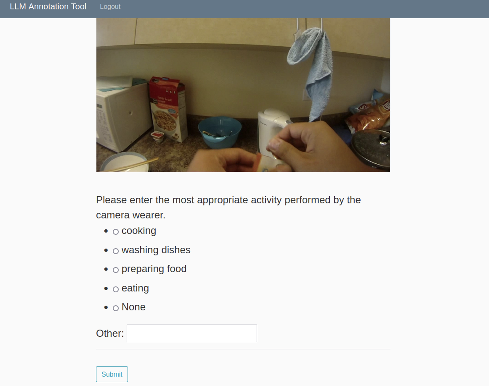

# LLM Annotation UI
This is a flask app that presents a UI to help image annotators annotate human activities using vision and language models. 



## Table of Contents
- [Prerequisites](#prerequisites)
- [Running the App](#running-the-app)


## Prerequisites
You can clone this repository. Before you begin, ensure all the packages are installed by running the following command in a virtual environment:
`pip install -r requirements.txt`

## Running The App

If you are running the app for the first time, you will need to initialize the database. You can do so by opening a python interpreter in your virtual environment. Run the following commands to initialize the database. 

```
>>> from llm_app import app, db
>>> app.app_context().push()
>>> db.create_all()
```
You can run the app in your localhost by running the following command:

`python3 run.py`
